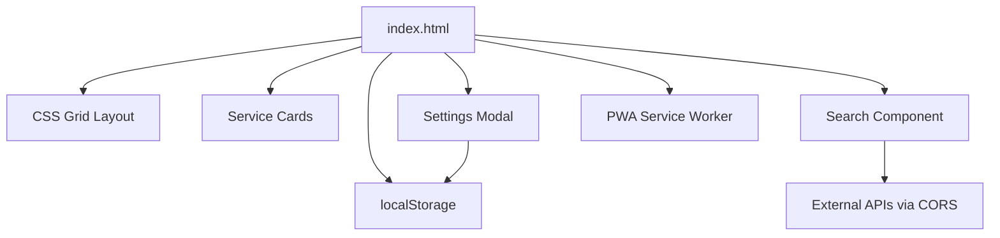

Here's a purely frontend dashboard feature set with no backend requirements:

## Core Features

### 1. **Service Management**
- **Service Cards** with icons, names, descriptions, and URLs
- **Category Groups** with collapsible sections  
- **Icon Support**: FontAwesome, Material Icons, or icon URLs only
- **Click-through links** to services (no status checking)

### 2. **Configuration**
| Method | Implementation |
|--------|----------------|
| **Local Storage** | Browser localStorage for persistence |
| **JSON Import/Export** | Download/upload config files |
| **Web Editor** | Modal forms to add/edit services |

Example config structure:
```json
{
  "services": [
    {
      "name": "Jellyfin",
      "url": "http://jellyfin.local",
      "icon": "fas fa-tv",
      "category": "Media",
      "description": "Media Server"
    }
  ]
}
```

### 3. **Static Widgets**
- **Clock Widget** with timezone support
- **Weather Widget** using client-side API calls (OpenWeather, etc.)
- **Custom HTML Widgets** for embedding content
- **Bookmarks Section** for quick links

### 4. **UI/UX Features**
```
Pure Frontend Design:
├── CSS Grid responsive layout
├── Touch-optimized for mobile
├── Progressive Web App (PWA) manifest
└── Offline functionality via service worker

Performance:
├── Single HTML file deployment
├── Vanilla JavaScript or Alpine.js
├── CSS-only animations
└── Icon fonts or SVG sprites
```

### 5. **Client-Side Search**
- **Local service filtering** with instant results
- **External search integration** via direct API calls:
  - Jellyseerr search (if CORS allows or via browser extension)
  - Public APIs only (no auth required)
- **Search suggestions** from localStorage history
- **Keyboard shortcuts** (/ or Ctrl+K)

### 6. **Customization**
- **Theme Switcher**: CSS custom properties for colors
- **Layout Options**: Grid columns (2-6), card sizes
- **Background**: CSS gradients or image URLs
- **Custom CSS**: Paste custom styles in settings

### 7. **Data Management**
- **Export Config**: Download JSON file
- **Import Config**: Upload JSON file
- **Reset**: Clear localStorage
- **Backup Reminder**: Periodic export prompts

## Architecture



## Implementation Details

**Single File Structure:**
```html
<!DOCTYPE html>
<html>
<head>
    <meta charset="utf-8">
    <meta name="viewport" content="width=device-width, initial-scale=1">
    <title>Homelab Dashboard</title>
    <link rel="manifest" href="manifest.json">
    <style>/* All CSS inline */</style>
</head>
<body>
    <!-- Dashboard HTML -->
    <script>/* All JavaScript inline */</script>
</body>
</html>
```

**Key Technologies:**
- **Vanilla JavaScript** or Alpine.js (lightweight)
- **CSS Grid** + Flexbox for responsive layout
- **CSS Custom Properties** for theming
- **LocalStorage API** for persistence
- **Fetch API** for external integrations
- **Service Worker** for offline support

## Deployment Options

1. **Static File Server**: Nginx, Apache, or any web server
2. **GitHub Pages**: Free hosting with custom domain
3. **Local File**: Open directly in browser (file://)
4. **USB Drive**: Portable dashboard